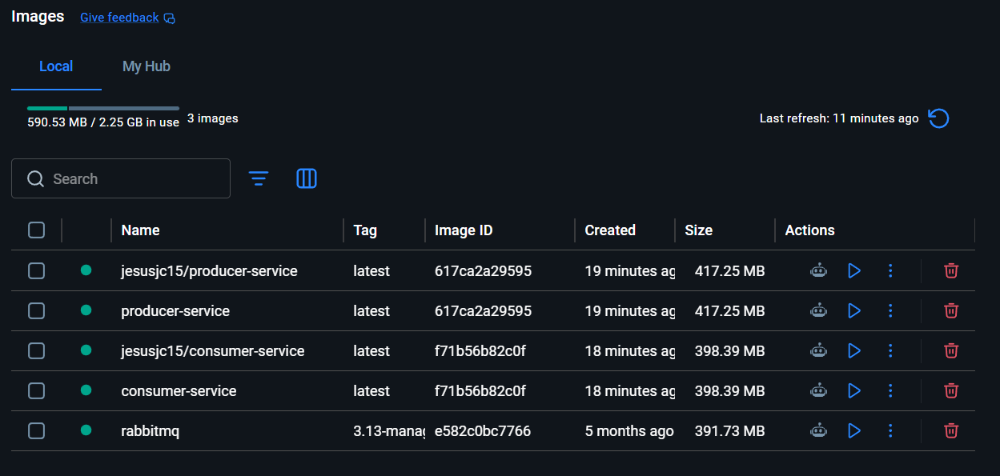
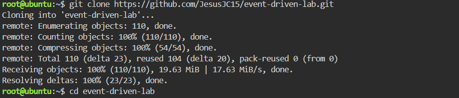
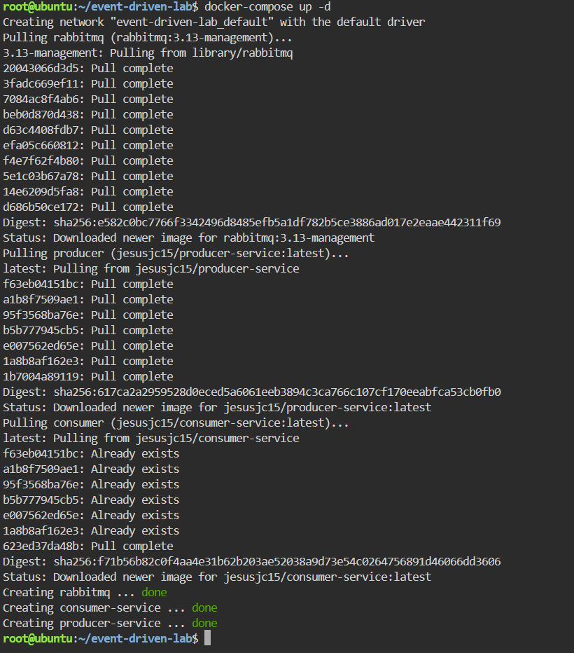
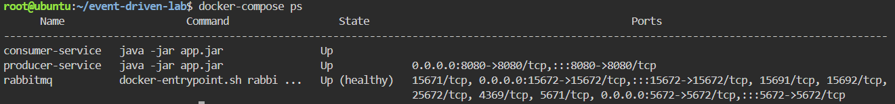
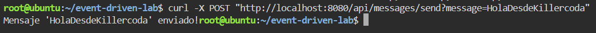
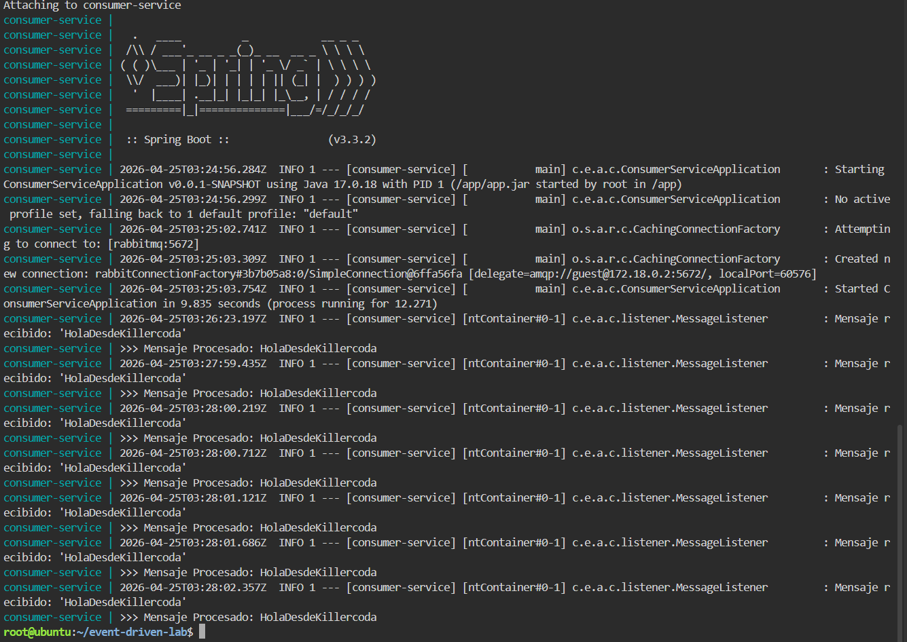
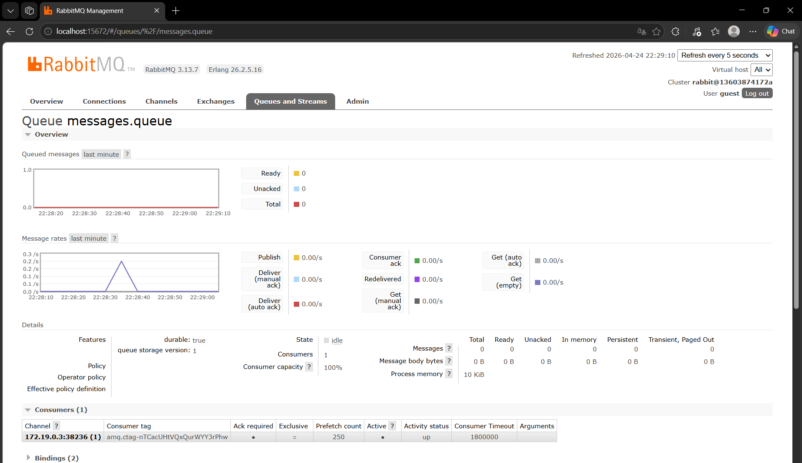
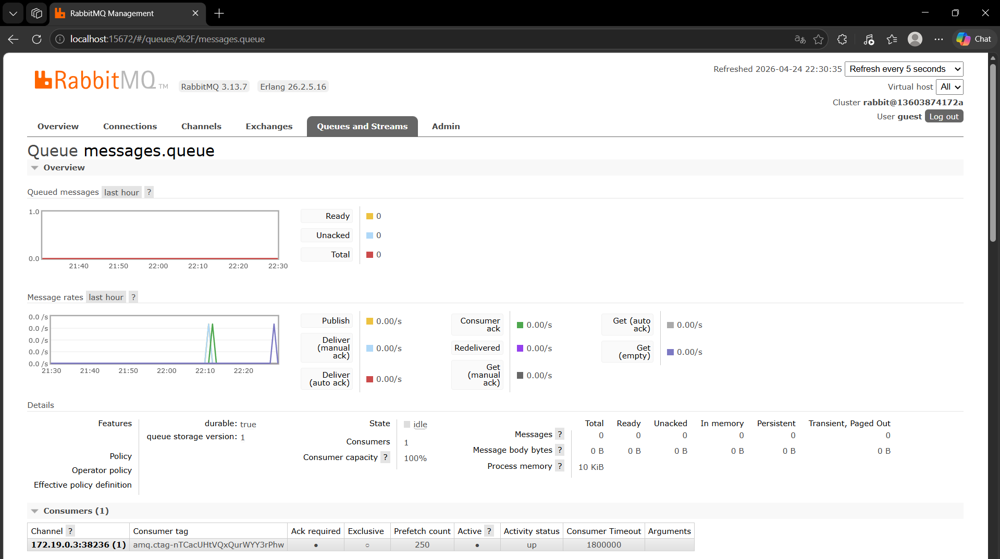

# event-driven-lab 🚀

Laboratorio completo de **arquitectura dirigida por eventos (Event-Driven)** usando **Spring Boot 3** y **RabbitMQ**.

Incluye dos microservicios Spring Boot, configuración Docker Compose, imágenes publicadas en Docker Hub, y guías para ejecutar en local o en Killercoda (entorno online gratuito).

---

## 📋 Tabla de Contenidos

- [Descripción](#descripción)
- [Arquitectura](#arquitectura)
- [Requisitos](#requisitos)
- [Estructura del Proyecto](#estructura-del-proyecto)
- [Instalación Local](#instalación-local)
- [Opción A: Killercoda](#opción-a-killercoda)
- [Probar Flujo de Eventos](#probar-flujo-de-eventos)
- [Servicios Expuestos](#servicios-expuestos)
- [Configuración RabbitMQ](#configuración-rabbitmq)
- [Compilar desde Código Fuente](#compilar-desde-código-fuente)
- [Limpiar el Entorno](#limpiar-el-entorno)
- [Recursos Adicionales](#recursos-adicionales)

---

## 📖 Descripción

Este proyecto implementa un patrón de **arquitectura dirigida por eventos** donde:

- **Producer Service**: Expone un endpoint REST (`POST /api/messages/send`) que acepta mensajes y los envía a una cola RabbitMQ.
- **Consumer Service**: Escucha mensajes de RabbitMQ y procesa eventos de forma asíncrona.
- **RabbitMQ**: Broker de mensajes que facilita la comunicación entre servicios.

### Características

✅ Comunicación asíncrona entre microservicios  
✅ Desacoplamiento de servicios mediante eventos  
✅ Fácil de escalar y resiliencia  
✅ Contenedores Docker listos para producción  
✅ Imágenes publicadas en Docker Hub  
✅ Interfaz de gestión RabbitMQ incluida  

---

## 🏗️ Arquitectura

```
┌─────────────────────────────────────────────────────────────┐
│                        Cliente HTTP                          │
└────────────────────────┬────────────────────────────────────┘
                         │
                    POST /api/messages/send
                         │
         ┌───────────────▼──────────────┐
         │    Producer Service          │
         │   (Spring Boot 3 - Java 17)  │
         │   Port: 8080                 │
         └───────────────┬──────────────┘
                         │
                    Publica evento
                         │
         ┌───────────────▼──────────────┐
         │       RabbitMQ Broker        │
         │  (AMQP 5672, UI 15672)       │
         │  Exchange: messages.exchange │
         │  Queue: messages.queue       │
         └───────────────┬──────────────┘
                         │
                  Consume evento
                         │
         ┌───────────────▼──────────────┐
         │    Consumer Service          │
         │   (Spring Boot 3 - Java 17)  │
         │   Procesa mensaje            │
         └──────────────────────────────┘
```

---

## 🔧 Requisitos

### Para ejecutar con Docker (recomendado)

- Docker 20.10+
- Docker Compose V1 (`docker-compose`) o V2 (`docker compose`)
- ~2 GB RAM disponible

### Para compilar desde código fuente

- Java 17 JDK
- Maven 3.9+
- Docker (para construir imágenes)

---

## 📁 Estructura del Proyecto

```text
event-driven-lab/
├── producer-service/
│   ├── src/main/java/com/eci/arcn/producer_service/
│   │   ├── ProducerServiceApplication.java          # Clase principal Spring Boot
│   │   ├── config/
│   │   │   └── RabbitMQConfig.java                  # Configuración Exchange, Queue, Binding
│   │   └── controller/
│   │       └── MessageController.java               # Endpoint REST /api/messages/send
│   ├── src/main/resources/
│   │   └── application.properties                   # Configuración RabbitMQ, puerto 8080
│   ├── pom.xml                                      # Dependencias Maven (Spring Boot, AMQP)
│   └── Dockerfile                                   # Imagen multi-stage Java 17
│
├── consumer-service/
│   ├── src/main/java/com/eci/arcn/consumer_service/
│   │   ├── ConsumerServiceApplication.java          # Clase principal Spring Boot
│   │   ├── config/
│   │   │   └── RabbitMQConfig.java                  # Declaración de Queue
│   │   └── listener/
│   │       └── MessageListener.java                 # @RabbitListener para procesar eventos
│   ├── src/main/resources/
│   │   └── application.properties                   # Configuración RabbitMQ
│   ├── pom.xml                                      # Dependencias Maven (Spring Boot, AMQP)
│   └── Dockerfile                                   # Imagen multi-stage Java 17
│
├── docker-compose.yml                               # Orquestación: RabbitMQ + Producer + Consumer
├── README.md                                        # Este archivo
└── .gitignore
```

---

## 🚀 Instalación Local

### 1️⃣ Clonar el repositorio

```bash
git clone https://github.com/<tu-usuario>/event-driven-lab.git
cd event-driven-lab
```

### 2️⃣ Verificar instalación de Docker

```bash
docker --version
docker-compose --version    # O: docker compose version
```

### 3️⃣ Levantar servicios con Docker Compose

**Opción A (Compose V1 - binario clásico, más común):**

```bash
docker-compose up -d
```

**Opción B (Compose V2 - plugin moderno):**

```bash
docker compose up -d
```

Si no sabes cuál tienes, prueba primero con `docker-compose --version`.

### 4️⃣ Verificar estado de los servicios

```bash
docker-compose ps
```



#### Evidencias desde Killercoda



---

## 🌐 Opción A: Killercoda

**¿Por qué Killercoda?** Es un sandbox Linux gratuito en el navegador con Docker preinstalado.

### Pasos

1. **Abre Killercoda:**
   - Navega a <https://killercoda.com/playgrounds/create/ubuntu>
   - Inicia sesión con GitHub o Google

2. **Clona el repositorio:**

   ```bash
   git clone https://github.com/<tu-usuario>/event-driven-lab.git
   cd event-driven-lab
   ```

3. **Verifica Compose:**

   ```bash
   docker-compose --version
   ```

4. **Levanta los servicios:**

   ```bash
   docker-compose up -d
   ```

   

5. **Espera ~30 segundos a que RabbitMQ esté listo:**

   ```bash
   docker-compose ps
   ```

   

6. **Expone los puertos en Killercoda:**
   - Haz clic en el botón **"Traffic / Port"** (esquina superior derecha)
   - Expone puerto **8080** (Producer API)
   - Expone puerto **15672** (RabbitMQ Management UI)

---

## 🧪 Probar Flujo de Eventos

### Paso 1: Enviar un mensaje desde el Productor

```bash
curl -X POST "http://localhost:8080/api/messages/send?message=HolaDesdeKillercoda"
```

**Respuesta esperada:**

```
Mensaje 'HolaDesdeKillercoda' enviado!
```



### Paso 2: Verificar recepción en el Consumidor

```bash
docker-compose logs consumer --tail 20
```

**Deberías ver logs similares a:**

```
consumer-service  | 2026-04-25T03:11:33.248Z  INFO 1 --- [consumer-service] [ntContainer#0-2] c.e.a.c.listener.MessageListener         : Mensaje recibido: 'HolaDesdeKilercoda'
consumer-service  | >>> Mensaje Procesado: HolaDesdeKilercoda
```



### Paso 3: Visualizar en RabbitMQ Management UI

- Abre <http://localhost:15672>
- Inicia sesión: `guest` / `guest`
- Ve a la pestaña **Queues**
- Haz clic en `messages.queue`
- Verás estadísticas de mensajes enviados, reconocidos, etc.





### Paso 4: Test End-to-End Completo

Prueba el flujo completo en un terminal:

```bash
# Terminal 1: Monitorear logs del consumidor
docker-compose logs -f consumer

# Terminal 2: Enviar múltiples mensajes
curl -X POST "http://localhost:8080/api/messages/send?message=Mensaje1"
curl -X POST "http://localhost:8080/api/messages/send?message=Mensaje2"
curl -X POST "http://localhost:8080/api/messages/send?message=Mensaje3"
```

---

## 🌐 Servicios Expuestos

| Servicio | URL / Puerto | Descripción |
|----------|-------------|-------------|
| **Producer API** | <http://localhost:8080> | Endpoint REST para enviar mensajes |
| **RabbitMQ AMQP** | localhost:5672 | Protocolo AMQP para producer/consumer |
| **RabbitMQ UI** | <http://localhost:15672> | Interfaz de gestión (guest/guest) |

### Endpoints del Productor

#### `POST /api/messages/send`

Envía un mensaje a la cola de RabbitMQ.

**Parámetros:**

- `message` (query param, string): Contenido del mensaje

**Ejemplo:**

```bash
curl -X POST "http://localhost:8080/api/messages/send?message=Mi%20primer%20evento"
```

**Respuesta:**

```
Mensaje 'Mi primer evento' enviado!
```

---

## 📊 Configuración RabbitMQ

### Exchange

- **Nombre:** `messages.exchange`
- **Tipo:** `DirectExchange`
- **Durabilidad:** `true` (persiste tras reinicio del broker)

### Queue

- **Nombre:** `messages.queue`
- **Durabilidad:** `true`
- **Routing Key:** `messages.routingkey`

### Binding

- **Exchange → Queue:** DirectExchange con routing key exacta
- Garantiza que mensajes con `messages.routingkey` lleguen a `messages.queue`

### Archivos de Configuración

**producer-service/src/main/resources/application.properties:**

```properties
spring.application.name=producer-service
server.port=8080
spring.rabbitmq.host=rabbitmq
spring.rabbitmq.port=5672
spring.rabbitmq.username=guest
spring.rabbitmq.password=guest
app.rabbitmq.exchange=messages.exchange
app.rabbitmq.queue=messages.queue
app.rabbitmq.routingkey=messages.routingkey
```

**consumer-service/src/main/resources/application.properties:**

```properties
spring.application.name=consumer-service
spring.rabbitmq.host=rabbitmq
spring.rabbitmq.port=5672
spring.rabbitmq.username=guest
spring.rabbitmq.password=guest
app.rabbitmq.queue=messages.queue
```

---

## 📦 Compilar desde Código Fuente

Si quieres construir las imágenes localmente:

```bash
# Compilar producer-service
cd producer-service
mvn clean package
docker build -t producer-service:local .
cd ..

# Compilar consumer-service
cd consumer-service
mvn clean package
docker build -t consumer-service:local .
cd ..
```

Luego actualiza `docker-compose.yml` para usar las imágenes locales:

```yaml
services:
  producer:
    image: producer-service:local   # En lugar de jesusjc15/producer-service:latest
    # ... resto de configuración

  consumer:
    image: consumer-service:local   # En lugar de jesusjc15/consumer-service:latest
    # ... resto de configuración
```

---

## 🧹 Limpiar el Entorno

### Parar servicios (sin eliminar datos)

```bash
docker-compose stop
```

### Parar y eliminar contenedores

```bash
docker-compose down
```

### Parar y eliminar volúmenes (cuidado, borra datos)

```bash
docker-compose down -v
```

### Eliminar imágenes descargadas

```bash
docker image rm rabbitmq:3.13-management
docker image rm jesusjc15/producer-service:latest
docker image rm jesusjc15/consumer-service:latest
```

---

## 📚 Recursos Adicionales

### Documentación

- [Spring for RabbitMQ](https://spring.io/projects/spring-amqp)
- [RabbitMQ Official Docs](https://www.rabbitmq.com/documentation.html)
- [Docker Compose Reference](https://docs.docker.com/compose/compose-file/)
- [Killercoda Docs](https://docs.killercoda.com/)

### Imágenes Docker usadas

- **Producer & Consumer:**
  - `jesusjc15/producer-service:latest`
  - `jesusjc15/consumer-service:latest`
  - (Publicadas en Docker Hub)
  
- **RabbitMQ:** `rabbitmq:3.13-management` (imagen oficial)
- **Java Runtime:** `eclipse-temurin:17-jre-jammy` (en Dockerfiles)

### Comandos útiles

```bash
# Ver logs en tiempo real
docker-compose logs -f consumer

# Ejecutar comando dentro del contenedor
docker-compose exec producer bash

# Inspeccionar la red Docker
docker network ls
docker network inspect event-driven-lab_default

# Ver recursos usados
docker stats

# Acceder a bash en contenedor para debugging
docker-compose exec consumer /bin/bash

# Ver variables de entorno en contenedor
docker-compose exec producer env | grep SPRING
```

---

## 🎓 Casos de Uso

Este patrón es perfecto para:

- ✅ Procesamiento de órdenes (Order → Inventory Update → Notification)
- ✅ Logging distribuido (múltiples servicios → log aggregator)
- ✅ Notificaciones en tiempo real (evento → email/SMS/push)
- ✅ Procesamiento batch asíncrono (upload file → proceso → resultado)
- ✅ Microservicios desacoplados
- ✅ Sistemas de colas para tareas pesadas
- ✅ Integración entre sistemas legacy y modernos
